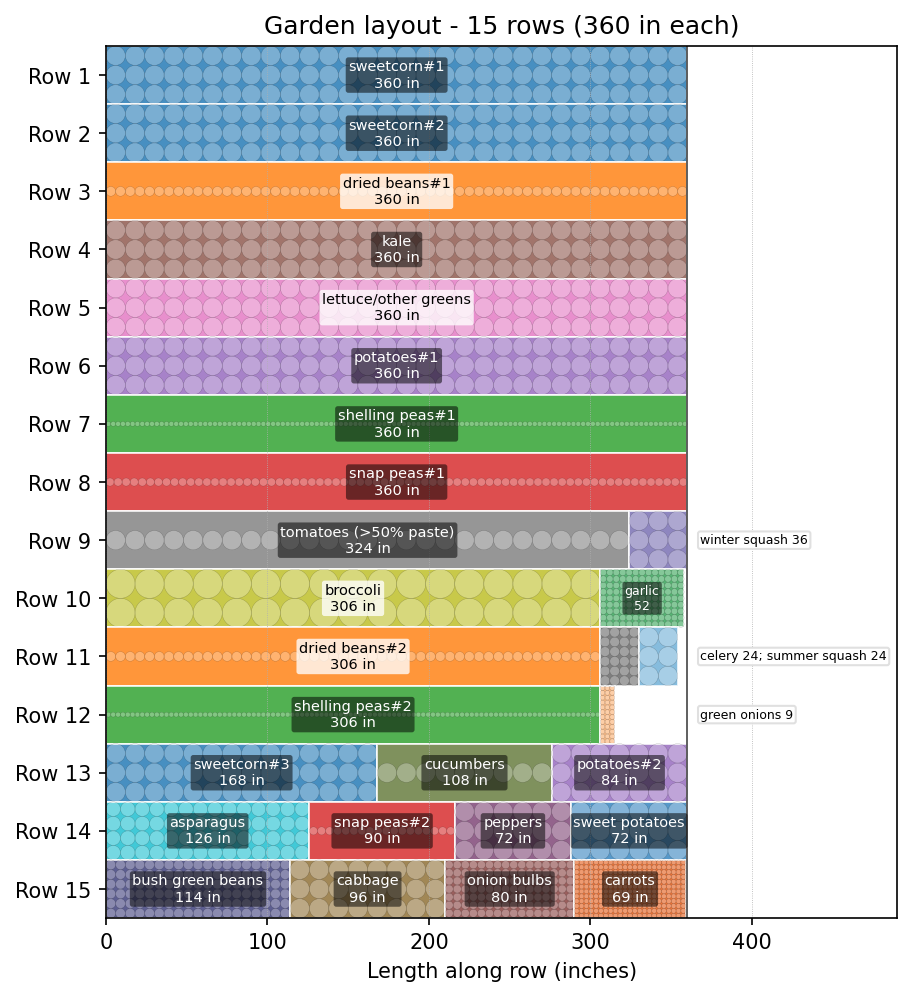

# VegPacker

VegPacker turns `plants.csv` into a scaled garden-row layout and an image.

The normal workflow is:

```bash
python3 scale_garden.py plants.csv --rows 15
python3 draw_garden.py
```

`scale_garden.py` finds the largest proportional version of the planting plan that fits the requested row count. `draw_garden.py` renders the resulting layout with plant circles sized from `plants.csv`.



## Project Files

- `plants.csv` - source crop counts, spacing, and planting style.
- `scale_garden.py` - scales counts and packs the layout into rows.
- `draw_garden.py` - renders a layout CSV as a PNG using `plants.csv` for spacing and planting style.
- `output/` - generated layout CSVs and images.
- `archive/` - older experiments, previous generated files, and the retired C version.

## Inputs

`plants.csv` must have these columns:

```csv
plant,how_much_to_plant_per_2_people_per_year,spacing_in,planting_style
asparagus,72,9,grid
broccoli,43,18,grid
bush green beans,143,6,grid
cucumbers,11,12,trellis
shelling peas,286,3,trellis
tomatoes (>50% paste),34,12,trellis
```

`planting_style` must be one of:

- `grid` - `spacing_in` is the diameter of each planting space. The scaler estimates how many plants fit across a row using `bed_width // spacing_in`.
- `trellis` - plants are placed in one line down the row. Required row length is `count * spacing_in`.

The count column can have a descriptive name as long as it starts with `how_much_to_plant`.

## Scale And Pack

Fit the plan into 15 rows:

```bash
python3 scale_garden.py plants.csv --rows 15
```

Default output:

```text
output/garden_scaled_layout.csv
```

The layout CSV has:

```csv
row,segment_label,length_in,crop
1,sweetcorn#1,360,sweetcorn
9,tomatoes (>50% paste),324,tomatoes (>50% paste)
```

Useful options:

```bash
python3 scale_garden.py plants.csv \
  --rows 12 \
  --row-len 360 \
  --bed-width 36 \
  --output output/garden_12row_layout.csv
```

## Render

Render the default scaled layout:

```bash
python3 draw_garden.py
```

Default input/output:

```text
output/garden_scaled_layout.csv
output/garden_scaled_rows.png
```

Render a custom layout:

```bash
python3 draw_garden.py output/garden_12row_layout.csv output/garden_12row_rows.png
```

You can also pass a custom plant metadata CSV as the third argument:

```bash
python3 draw_garden.py output/garden_12row_layout.csv output/garden_12row_rows.png plants.csv
```

Grid crops are drawn as filled grids of circles. Trellis crops are drawn as a single centered line of circles. Circle diameter equals `spacing_in`, and colors are assigned consistently by crop. Very small segments keep their graphics visible by moving their labels into a right-side notes column.
